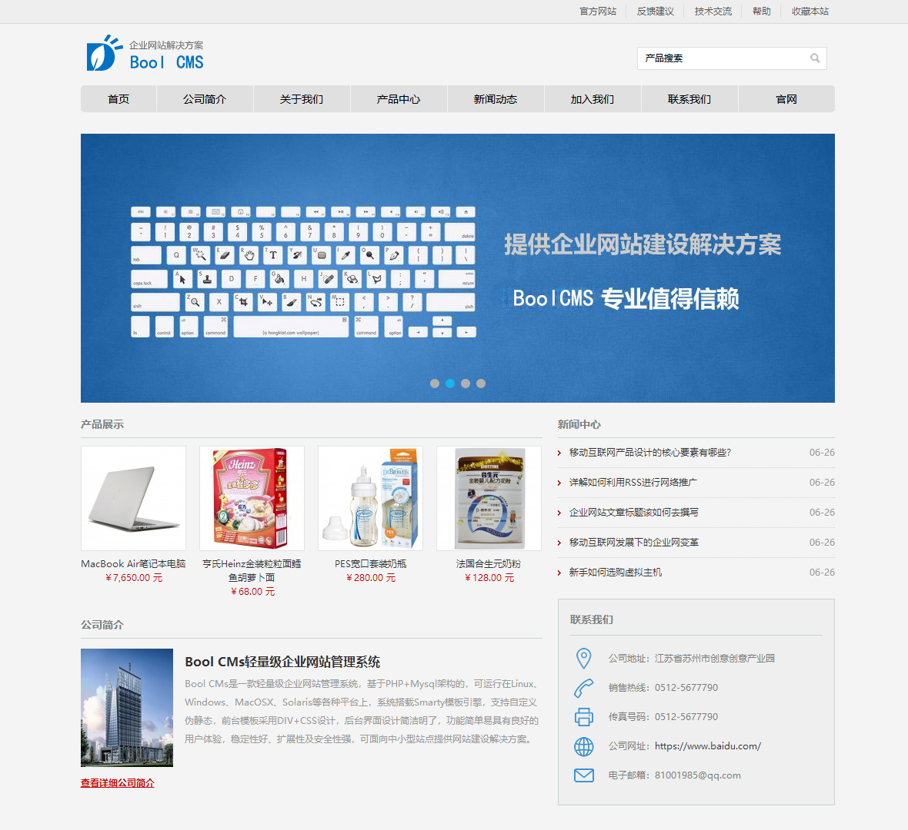
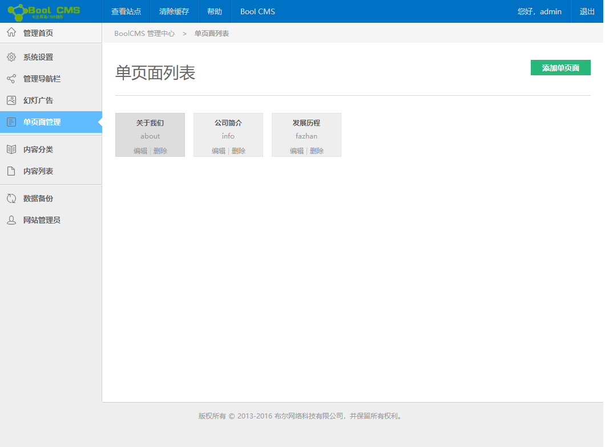

# 🚀 BoolCMS 内容管理系统

<p align="center">
  
  
  
</p>

> 一款轻量级、易扩展的企业级内容管理系统，基于 ThinkPHP 3.2.3 框架开发

---

## � 项目演示

<p align="center">
  
  <br>
  <sub>🏠 前台首页</sub>
</p>

<br>

<p align="center">
  
  <br>
  <sub>⚙️ 后台管理</sub>
</p>

---

## � 目录

- [功能特性](#-功能特性)
- [环境要求](#-环境要求)
- [快速安装](#-快速安装)
- [目录结构](#-目录结构)
- [后台功能](#-后台功能)
- [配置说明](#-配置说明)
- [技术支持](#-技术支持)

---

## ✨ 功能特性

| 功能模块 | 说明 |
|---------|------|
| 🏠 前台展示 | 响应式页面设计，支持多栏目导航 |
| 👤 后台管理 | 完整的权限管理，支持多管理员 |
| 📝 内容管理 | 文章发布、编辑、分类管理 |
| 🖼️ 轮播管理 | 首页轮播图自定义配置 |
| 📄 单页管理 | 关于我们等单页面管理 |
| 📑 菜单管理 | 自定义导航菜单结构 |
| 💾 数据备份 | 支持数据库备份与恢复 |
| ⚙️ 系统配置 | 网站信息、邮件、水印等配置 |

---

## 🛠️ 环境要求

| 环境 | 版本要求 |
|------|---------|
| PHP | >= 5.3.0 |
| MySQL | 5.0+ |
| Web服务器 | Apache / Nginx |

---

## ⚡ 快速安装

### 🔧 方式一：图形化安装（推荐）

#### 1️⃣ 放置代码
将源码放到网站根目录

#### 2️⃣ 运行安装程序
浏览器访问：
```
http://yourdomain/install.php
```

#### 3️⃣ 填写数据库信息
| 配置项 | 默认值 | 说明 |
|--------|--------|------|
| 数据库主机 | `localhost` | MySQL服务器地址 |
| 数据库账号 | `root` | MySQL用户名 |
| 数据库密码 | - | MySQL密码 |
| 数据库名称 | `boolcms` | 数据库名（会自动创建） |
| 数据表前缀 | `bool_` | 表前缀 |

点击「开始安装」按钮，等待安装完成

#### 4️⃣ 访问系统
| 入口 | 地址 |
|------|------|
| 🏠 前台首页 | `http://yourdomain/index.php` |
| 🔐 后台管理 | `http://yourdomain/admin.php` |

> ⚠️ **安全提示**：安装完成后请立即删除 `install.php` 文件！

> 默认后台账号：`admin` / `admin`

---

### 📝 方式二：手动安装

#### 1️⃣ 下载源码

```bash
git clone https://github.com/yourusername/boolcms.git
cd boolcms
```

#### 2️⃣ 导入数据库

```bash
# 使用 MySQL 命令行或 phpMyAdmin 导入
mysql -u root -p < bool_admin.sql
```

#### 3️⃣ 配置数据库

编辑 `Apps/Common/Conf/config.php`：

```php
return array(
    'DB_TYPE'   => 'mysql',
    'DB_HOST'   => 'localhost',
    'DB_NAME'   => 'boolcms',
    'DB_USER'   => 'root',
    'DB_PWD'    => 'your_password',
    'DB_PORT'   => 3306,
    'DB_PREFIX' => 'bool_',
);
```

#### 4️⃣ 访问系统

| 入口 | 地址 |
|------|------|
| 🏠 前台首页 | `http://yourdomain/index.php` |
| 🔐 后台管理 | `http://yourdomain/admin.php` |

> 默认后台账号：`admin` / `admin`

---

## 📁 目录结构

```
boolcms/
├── 📂 Apps/                    # 应用目录
│   ├── 📂 Admin/              # 后台管理模块
│   │   ├── 📂 Controller/     # 控制器
│   │   ├── 📂 Model/          # 模型
│   │   └── 📂 View/           # 视图模板
│   ├── 📂 Home/               # 前台模块
│   │   ├── 📂 Controller/
│   │   ├── 📂 Model/
│   │   └── 📂 View/
│   ├── 📂 Common/             # 公共模块
│   └── 📂 Runtime/            # 运行时缓存
├── 📂 Config/                 # 配置文件
├── 📂 Public/                 # 静态资源
│   ├── 📂 Admin/             # 后台资源
│   │   ├── 📂 css/
│   │   ├── 📂 js/
│   │   └── 📂 images/
│   └── 📂 Uploads/           # 上传文件目录
├── 📂 ThinkPHP/              # 框架核心
├── 📄 admin.php              # 后台入口
├── 📄 index.php              # 前台入口
└── 📄 bool_admin.sql         # 数据库文件
```

---

## 🎛️ 后台功能

### 内容管理
| 功能 | 描述 |
|------|------|
| 文章列表 | 文章增删改查、批量操作 |
| 分类管理 | 无限级栏目分类 |
| 单页管理 | 独立页面管理 |

### 系统设置
| 功能 | 描述 |
|------|------|
| 网站配置 | 站点名称、LOGO、SEO信息等 |
| 轮播管理 | 首页轮播图设置 |
| 菜单管理 | 导航菜单自定义 |

### 系统工具
| 功能 | 描述 |
|------|------|
| 管理员管理 | 后台账号权限管理 |
| 数据备份 | 数据库备份与恢复 |
| 系统配置 | 邮件、水印等高级配置 |

---

## ⚙️ 配置说明

### 网站基本信息 (`Config/config.php`)

| 配置项 | 默认值 | 说明 |
|--------|--------|------|
| `title` | boolcms | 网站标题 |
| `keywords` | boolcms,测试 | SEO关键词 |
| `description` | boolcms | SEO描述 |
| `icp` | 苏B2-20090191 | ICP备案号 |
| `tel` | 0512-5677790 | 联系电话 |
| `email` | 81001985@qq.com | 联系邮箱 |

### 图片处理配置

| 配置项 | 默认值 | 说明 |
|--------|--------|------|
| `thumb` | 1 | 是否开启缩略图 |
| `thumb_width` | 200 | 缩略图宽度 |
| `thumb_height` | 100 | 缩略图高度 |
| `water` | 1 | 是否开启水印 |

### 邮件配置

| 配置项 | 默认值 | 说明 |
|--------|--------|------|
| `mail_host` | smtp.qq.com | SMTP服务器 |
| `mail_port` | 25 | SMTP端口 |
| `mail_username` | admin | 发件账号 |
| `mail_password` | admin | 发件密码 |

---

## 🔒 安全建议

1. **修改默认密码** - 首次登录后请修改后台默认账号密码
2. **数据库安全** - 生产环境请使用复杂数据库密码
3. **入口安全** - 建议修改 `admin.php` 文件名增强安全性
4. **目录权限** - 确保 `Apps/Runtime` 和 `Uploads` 目录可写
5. **关闭调试** - 生产环境请设置 `APP_DEBUG` 为 `false`

---

## 📄 开源协议

本项目基于 [Apache License 2.0](http://www.apache.org/licenses/LICENSE-2.0) 开源协议发布

---

## 🤝 技术支持

| 联系方式 | 信息 |
|---------|------|
| 📧 邮箱 | 81001985@qq.com |
| 📍 地址 | 江苏省苏州市创意产业园 |

---

<p align="center">
  <sub>Built with ❤️ using ThinkPHP 3.2.3</sub>
</p>
